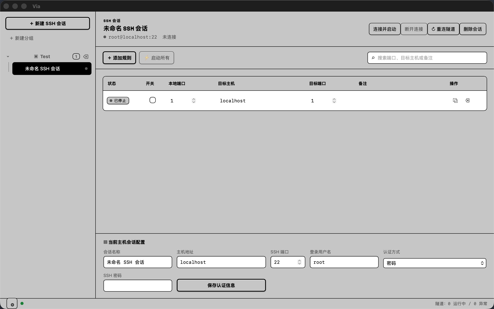
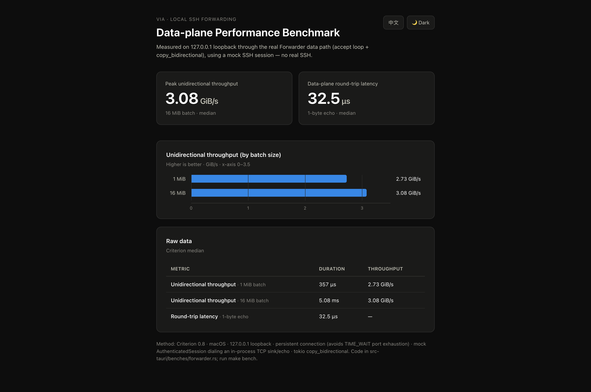

# Via

> 一款 macOS 桌面 SSH 本地端口转发管理器，用于统一管理、记录和运行 SSH 本地端口转发隧道。
>
> A macOS desktop SSH local port-forwarding manager for centrally managing, recording, and running SSH local port-forwarding tunnels.

## 为什么做 Via · Why Via

**中文：** 在工作中我需要用 SSH 做远程转发，把本地端口经跳板机转发到内网服务。之前一直用 bash 脚本统一启动这些转发隧道，但始终没有找到一款合适的软件来统一管理和记录这些 SSH 连接。于是我开发了 Via——一个可以统一进行 SSH 远程转发与管理的桌面工具。

**English:** At work I rely on SSH remote forwarding to reach internal services through a bastion host. I used to start all these tunnels with bash scripts, but I couldn't find a tool that let me centrally manage and keep track of them. So I built Via — a desktop app for unified SSH local forwarding and management.



## 核心原理 · How It Works

Via 只做一件事：把本机端口经 SSH 会话安全地转发到远端内网地址。

Via does one thing well: forward a local port to a remote internal address through an authenticated SSH session.

```
本地客户端 local client ──► 127.0.0.1:local_port ──► SSH 会话 / session (跳板机 bastion) ──► target_host:target_port
```

工作流程 / How it works：

1. Via 在 `127.0.0.1:<local_port>` 上监听一个 TCP 端口（`TcpListener`）。
2. 每收到一个本地连接，就通过已认证的 SSH 会话打开一条 `direct-tcpip` 通道。
3. SSH 服务器在远端网络连接 `target_host:target_port`。
4. Via 在本端连接与 SSH 通道之间双向拷贝字节流（`copy_bidirectional`），让本地端口透明地到达只能由 SSH 服务器访问的内网服务。

所有隧道仅绑定 `127.0.0.1`，不暴露到局域网。

---

1. Via binds a TCP listener on `127.0.0.1:<local_port>`.
2. For each accepted local connection it opens a `direct-tcpip` channel over the authenticated SSH session.
3. The SSH server connects to `target_host:target_port` on the remote network.
4. Via copies bytes bidirectionally between the local connection and the SSH channel, so a local port transparently reaches a service only accessible from the SSH server.

Every tunnel binds only to `127.0.0.1` and is never exposed to the LAN.

## 功能范围 · Scope

- 仅支持 SSH Local Forwarding：`127.0.0.1:local_port → SSH session → target_host:target_port`。
- 支持密码认证、私钥文件认证与加密私钥口令。
- 凭据仅本地保存；有应用主密码时加密保存，无主密码时不持久化。
- JSON 导入/导出只含分组、会话非敏感字段与转发规则，永不导出密码、私钥口令、私钥内容或主密码。
- 支持端口冲突隔离、单条/批量启停和断线自动重连。

V1 不提供 Remote Forwarding、Dynamic/SOCKS5、终端、SFTP、云端同步或跨平台支持。

---

- SSH Local Forwarding only: `127.0.0.1:local_port → SSH session → target_host:target_port`.
- Password, private-key, and encrypted private-key passphrase authentication.
- Credentials are stored locally only; encrypted when a master password is set, never persisted otherwise.
- JSON import/export carries only groups, non-sensitive session fields, and forward rules — never passwords, key passphrases, private keys, or the master password.
- Port-conflict isolation, single/bulk start-stop, and automatic reconnect.

V1 does not provide remote forwarding, dynamic/SOCKS5, a terminal, SFTP, cloud sync, or cross-platform support.

## 发布产物 · Release artifacts

CI 会构建三种安装包：macOS（Apple Silicon 与 Intel）、Windows x64、Linux x64。当前仅 macOS 得到官方支持与测试；Windows x64 与 Linux x64 构建产物会随附发布，但未经过测试。

CI builds three installers: macOS (Apple Silicon and Intel), Windows x64, and Linux x64. Only macOS is officially supported and tested; the Windows x64 and Linux x64 artifacts are shipped but untested.

## 技术栈 · Tech Stack

| 层 Layer | 技术 Technology |
| --- | --- |
| 桌面框架 Desktop | Tauri 2 + Rust |
| 前端 Frontend | Vue 3、TypeScript、Vite |
| SSH | russh（密码 / 私钥认证） |
| 加密 Encryption | Argon2 + XChaCha20-Poly1305 AEAD |
| 本地存储 Storage | SQLite（单个 `via.db` 数据库） |
| 运行时 Runtime | Rust 管理配置、加密、SSH、端口监听、状态与重连 |

## 环境要求 · Requirements

- macOS 13 或更高版本 / macOS 13+
- Node.js 22+
- Rust stable（当前工程使用 Rust 2024 edition）
- Xcode Command Line Tools：`xcode-select --install`
- Tauri CLI：`cargo install tauri-cli --version "^2"`

## 快速开始 · Quick Start

```bash
make install
make dev
```

`make dev` 会启动 Vite 开发服务器及 Tauri 桌面窗口。首次执行 Rust 构建可能需要下载和编译依赖。

`make dev` launches the Vite dev server and the Tauri desktop window. The first Rust build may need to download and compile dependencies.

## 常用命令 · Commands

```bash
make help       # 查看全部命令 / list all commands
make install    # 按 package-lock.json 安装前端依赖 / install pinned frontend deps
make dev        # 启动桌面开发环境 / start the desktop dev environment
make format     # 格式化 TypeScript（Prettier）与 Rust（cargo fmt）
make build      # 构建前端并编译 Rust 二进制 / build frontend + Rust binary
make test       # 前端测试、类型检查、Rust 格式/Clippy/单测 / full test gate
make check      # 快速静态检查 / fast static checks
make package    # 生成并 ad-hoc 签名 macOS .app 包 / build + ad-hoc-sign the .app
make clean      # 删除 dist 与 Rust target 构建产物 / remove build artifacts
make clean-all  # 在 clean 基础上删除已安装的 JS 依赖 / also remove installed JS deps
```

`make package` 使用本机 ad-hoc 签名生成 `.app`，使本地开发环境可校验和运行。对外分发前仍须使用 Apple Developer ID 重新签名并完成公证；该命令不会上传或发布任何产物。

`make package` builds and ad-hoc-signs the `.app` locally so it can be verified and run in development. Re-sign with an Apple Developer ID and notarize before distributing; this command uploads or publishes nothing.

## 项目结构 · Project Structure

```text
src/                          Vue 前端 / frontend
src/types/via.ts              前后端传输 DTO / shared DTOs
src-tauri/src/domain/         会话、规则与校验模型 / domain models
src-tauri/src/storage/        本地配置、加密与安全导入导出 / storage & encryption
src-tauri/tests/              Rust 集成测试 / Rust integration tests
```

## 安全原则 · Security

- 隧道只能监听 `127.0.0.1`，不暴露至局域网。Tunnels bind only to `127.0.0.1`, never to the LAN.
- 导出配置永不携带凭据。Exported configs never contain credentials.
- 密码与私钥口令仅以加密 BLOB 形式写入本地 SQLite。Passwords and key passphrases are written only as encrypted BLOBs in the local SQLite DB.
- 日志不得记录密码、私钥口令或私钥内容。Logs must never record passwords, key passphrases, or private keys.
- 首次 SSH 连接将要求确认主机密钥指纹；指纹变化时应阻断连接。First-time SSH connections require host-key fingerprint approval; changed fingerprints block the connection.

### 主密码与恢复码 · Master password and recovery codes

首次启动必须设置应用主密码，用于保护保存在本机的 SSH 密码与私钥口令。初始化完成后会生成 10 枚恢复码且只显示一次；忘记主密码时可用一枚未使用的恢复码重设。恢复码只恢复对本机加密凭据副本的访问，无法找回远端服务器上的 SSH 凭据。

Via requires a master password to protect locally stored SSH credentials. Ten recovery codes are generated once and shown once; an unused code can reset the master password. Recovery only restores access to the local encrypted credential copy — it cannot recover credentials from remote SSH servers.

## 开发验证 · Development

提交前运行 / run before committing：

```bash
make test
make format
make build
```

## Benchmark
